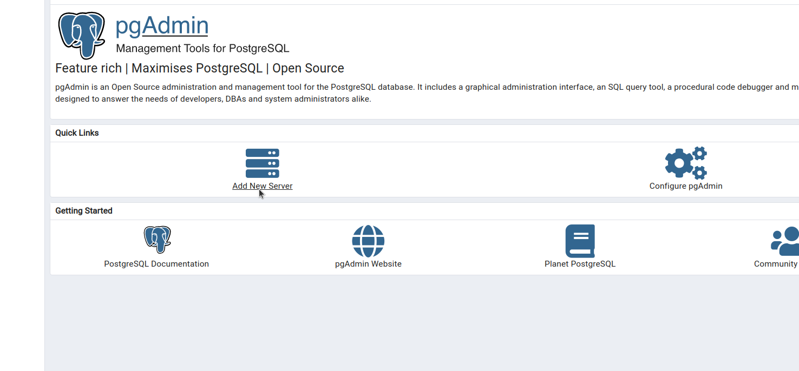

# Hotel-Cancun-API
REST API system using Java 17.5 and Spring Boot as a part of the technical assessment in the Alten Group recruitment process.

## Scenario description:

- API will be maintained by the hotel’s IT department.
- As it’s the very last hotel, the quality of service must be 99.99 to 100% => no downtime
- For the purpose of the test, we assume the hotel has only one room available
- To give a chance to everyone to book the room, the stay can’t be longer than 3 days and can’t be reserved more than 30 days in advance.
- All reservations start at least the next day of booking,
- To simplify the use case, a “DAY’ in the hotel room starts from 00:00 to 23:59:59.
- Every end-user can check the room availability, place a reservation, cancel it or modify it.
- To simplify the API is insecure.


**NOTE** 

- It was assumed a date format from [Date and time notation in Canada - Wikipedia](https://en.wikipedia.org/wiki/Date_and_time_notation_in_Canada#:~:text=The%20YYYY%20%2D%20MM%20%2D%20DD%20format%20is%20the%20only%20method%20of,formats%20often%20results%20in%20misinterpretation)


## Requirements:

```Maven```
```Spring Boot```
```PostgreSQL```
```Java v.17+```
```Docker```
```Docker-Compose```

## Running the project:

To run the project in the docker container, execute on the project root path:

`$ docker-compose up `

After that, wait a few second and the API endpoints will already be available for calling at `http://localhost:8081/api`.


If you want to run the project locally, without using the docker environment then:

1 - Change the application.properties configuration to the "dev" profile, as in the image below.**


2 - On the project root path, run:

`$ mvn clean install`

3- To start the project run:

`$ mvn spring-boot:run`


# API System Endpoints:

1 - **Create a booking endpoint:**

**Description**: API endpoint that creates a new booking reservation.\
**URI Syntax**: `POST http://localhost:8081/api/booking`  
**Input**:
- A JSON body, such as:
```json
{
    "clientName":"Alexsandro Saraiva",
    "checkIn": "2022-12-25",
    "checkOut": "2022-12-26"
}
```
**Output**:
- A JSON body with a created booking with a reservation code such as:
```json
{
    "id": 1,
    "clientName": "Alexsandro Saraiva",
    "reservationCode": 1671667890493,
    "checkIn": "2022-12-25",
    "checkOut": "2022-12-26"
}
```

2 - **Modify  booking endpoint:**

**Description**: API endpoint that modifies an existent booking by a reservation code and a given range of new dates.\
**URI Syntax**: `PATCH http://localhost:8081/api/booking/{reservationCode}/modify`
**Input**:
- {reservationCode} refers to a reservation code generate when create a booking successfully.
- A JSON body with a range of dates, such as:
   ```json
    {
    "checkIn": "2022-12-25",
    "checkOut": "2022-12-27"
    }
   ```
**Output**:
- A JSON body with the HttpStatus resulted of the process such as:
   ```HttpStatus
    {
        "OK"
    }
   ```
  
2 - **Cancel booking endpoint:**

**Description**: API endpoint that cancel a booking.\
**URI Syntax**: `PATCH http://localhost:8081/api/booking/{reservationCode}/cancel`
**Input**:
- {reservationCode} refers to a reservation code generate when create a booking successfully.

**Output**:
- A JSON body with the HttpStatus resulted of the process such as:
   ```HttpStatus
    {
        "OK"
    }
   ```


4 - **Get room availability endpoint:**

**Description**: API endpoint that get room availability by a given range of dates.\
**URI Syntax**: `GET http://localhost:8080/api/room/{id}/availability?check_in={checkIn}&check_out={checkOut}`

**Input**:
- {id} refers to a room id.
- {check_in} refers to the customer check in informed date.
- {check_out} refers to the customer check out informed date.


**Output**:
- A String informing that the set of days informed are available:
    ```String
    {
       Available Dates
    }
   ```

The complete documentation of endpoints can be verified in the link below:

``` 
 http://localhost:8081/api/swagger-ui/
```   

The Postman collection is located at the root of the project with the name **Alten_Hotel_API.postman_collection.json**.

## Access to Database Manager (PgMyadmin 4)

For this project, was used the PgAdmin4 as a database manager. To access run the comand below in browser and 
the main panel will appear :
``` 
 http://localhost:5050/
``` 


- Credencials
  -  Email/username
  ` admin@admin.com`
  -  Password
     ` pgadmin!`

**Notes**

As first utilization, will be necessary to link the pgAdmin to the postgres instance, for this step, 
after putting the credentials above:

- 1 Select create a server:
  


- 2 Pick a name of the server:


- 3 Create a connection as it follows:


- 4 Access the dashboard:


- 5 Check the stored data:


Alexsandro da Silva Saraiva \
alex_araiva14@hotmail.com\
2022 

